Table of Contents

* [Acknowledgements](#acknowledgements)
* [Setting up, getting started](#setting-up-getting-started)
* [Design](#design)
  * [Architecture](#architecture)
  * [UI component](#ui-component)
  * [Logic component](#logic-component)
  * [Model component](#model-component)
  * [Storage component](#storage-component)
  * [Common classes](#common-classes)
* [Implementations](#implementations)
  * [Adding attributes to contacts](#adding-attributes-to-contacts)
    * [Notes feature](#notes-feature)
    * [Favourite feature](#favourite-feature)
    * [Deadline feature](#deadline-feature)
    * [Add contact with address as optional field feature](#add-contact-with-address-as-optional-field-feature)
    * [High importance flag feature](#high-importance-flag-feature)
    * [Images feature](#images-feature)
  * [Adding features to Model](#adding-features-to-model)
    * [Find tag feature](#find-tag-feature)
  * [Assimilating new UI components](#assimilating-new-ui-components)
    * [Contact view feature](#contact-view-feature)
  * [Enhancing data storage](#enhancing-data-storage)
    * [\[Proposed\] Undo/Redo feature](#proposed-undoredo-feature)
* [Documentation, logging, testing, configuration, dev-ops](#documentation-logging-testing-configuration-dev-ops)
* [Appendix: Requirements](#appendix-requirements)
  * [Product scope](#product-scope)
  * [User stories](#user-stories)
  * [Use cases](#use-cases)
  * [Non-functional requirements](#non-functional-requirements)
  * [Glossary](#glossary)
* [Appendix: Instructions for manual testing](#appendix-instructions-for-manual-testing)
  * [Launch and shutdown](#launch-and-shutdown)
  * [Deleting a person](#deleting-a-person)
  * [Commands in detailed view](#commands-in-detailed-view)
  * [Creating a tag](#creating-a-tag)

--------------------------------------------------------------------------------------------------------------------

## **Acknowledgements**

* Star used to represent a favourited person
  * Reused from https://zetcode.com/gui/javafx/canvas/ with minor modifications to the points and fill, for suitable colour and size.

--------------------------------------------------------------------------------------------------------------------

## **Setting up, getting started**

Refer to the guide [_Setting up and getting started_](SettingUp.md).

--------------------------------------------------------------------------------------------------------------------

## **Design**

:bulb: **Tip:** The `.puml` files used to create diagrams in this document can be found in the [diagrams](https://github.com/AY2122S2-CS2103T-T12-2/tp/tree/master/docs/diagrams/) folder. Refer to the [_PlantUML Tutorial_ at se-edu/guides](https://se-education.org/guides/tutorials/plantUml.html) to learn how to create and edit diagrams.

### Architecture

The ***Architecture Diagram*** given above explains the high-level design of the App.

Given below is a quick overview of main components and how they interact with each other.

**Main components of the architecture**

**`Main`** has two classes called [`Main`](https://github.com/AY2122S2-CS2103T-T12-2/tp/tree/master/src/main/java/seedu/address/Main.java) and [`MainApp`](https://github.com/AY2122S2-CS2103T-T12-2/tp/tree/master/src/main/java/seedu/address/MainApp.java). It is responsible for,
* At app launch: Initializes the components in the correct sequence, and connects them up with each other.
* At shut down: Shuts down the components and invokes cleanup methods where necessary.

[**`Commons`**](#common-classes) represents a collection of classes used by multiple other components.

The rest of the App consists of four components.

* [**`UI`**](#ui-component): The UI of the App.
* [**`Logic`**](#logic-component): The command executor.
* [**`Model`**](#model-component): Holds the data of the App in memory.
* [**`Storage`**](#storage-component): Reads data from, and writes data to, the hard disk.

**How the architecture components interact with each other**

The *Sequence Diagram* below shows how the components interact with each other for the scenario where the user issues the command `delete 1`.

Each of the four main components (also shown in the diagram above),

* defines its *API* in an `interface` with the same name as the Component.
* implements its functionality using a concrete `{Component Name}Manager` class (which follows the corresponding API `interface` mentioned in the previous point.

For example, the `Logic` component defines its API in the `Logic.java` interface and implements its functionality using the `LogicManager.java` class which follows the `Logic` interface. Other components interact with a given component through its interface rather than the concrete class (reason: to prevent outside component's being coupled to the implementation of a component), as illustrated in the (partial) class diagram below.

The sections below give more details of each component.

### UI component

The **API** of this component is specified in [`Ui.java`](https://github.com/AY2122S2-CS2103T-T12-2/tp/tree/master/src/main/java/seedu/address/ui/Ui.java)

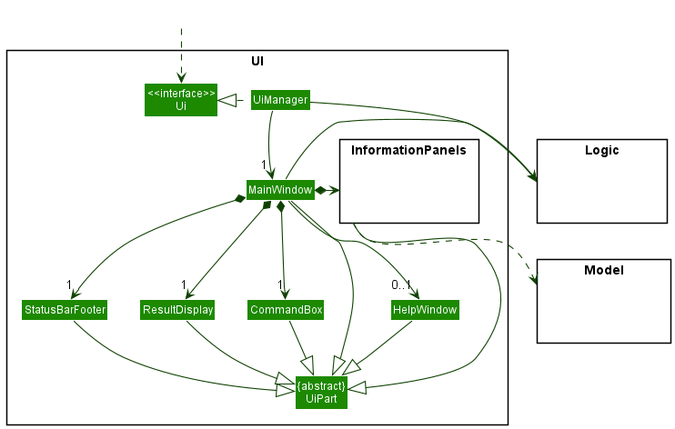

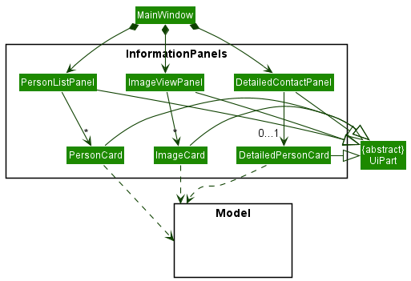

The UI consists of a `MainWindow` that is made up of parts e.g.`CommandBox`, `ResultDisplay`, `PersonListPanel`, `StatusBarFooter` etc. All these, including the `MainWindow`, inherit from the abstract `UiPart` class which captures the commonalities between classes that represent parts of the visible GUI.

The `UI` component uses the JavaFx UI framework. The layout of these UI parts are defined in matching `.fxml` files that are in the `src/main/resources/view` folder. For example, the layout of the [`MainWindow`](https://github.com/AY2122S2-CS2103T-T12-2/tp/blob/master/src/main/java/seedu/address/ui/MainWindow.java) is specified in [`MainWindow.fxml`](https://github.com/AY2122S2-CS2103T-T12-2/tp/blob/master/src/main/resources/view/MainWindow.fxml)

The `UI` component,

* executes user commands using the `Logic` component.
* listens for changes to `Model` data so that the UI can be updated with the modified data.
* keeps a reference to the `Logic` component, because the `UI` relies on the `Logic` to execute commands.
* depends on some classes in the `Model` component, as it displays `Person` object residing in the `Model`.

### Logic component

**API** : [`Logic.java`](https://github.com/AY2122S2-CS2103T-T12-2/tp/tree/master/src/main/java/seedu/address/logic/Logic.java)

Here's a (partial) class diagram of the `Logic` component:

How the `Logic` component works:
1. When `Logic` is called upon to execute a command, it uses the `AddressBookParser` class to parse the user command.
1. This results in a `Command` object (more precisely, an object of one of its subclasses e.g., `AddCommand`) which is executed by the `LogicManager`.
1. The command can communicate with the `Model` when it is executed (e.g. to add a person).
1. The result of the command execution is encapsulated as a `CommandResult` object which is returned back from `Logic`.

The Sequence Diagram below illustrates the interactions within the `Logic` component for the `execute("delete 1")` API call.

:information_source: **Note:** The lifeline for `DeleteCommandParser` should end at the destroy marker (X) but due to a limitation of PlantUML, the lifeline reaches the end of diagram.

Here are the other classes in `Logic` (omitted from the class diagram above) that are used for parsing a user command:

How the parsing works:
* When called upon to parse a user command, the `AddressBookParser` class creates an `XYZCommandParser` (`XYZ` is a placeholder for the specific command name e.g., `AddCommandParser`) which uses the other classes shown above to parse the user command and create a `XYZCommand` object (e.g., `AddCommand`) which the `AddressBookParser` returns back as a `Command` object.
* All `XYZCommandParser` classes (e.g., `AddCommandParser`, `DeleteCommandParser`, ...) inherit from the `Parser` interface so that they can be treated similarly where possible e.g, during testing.

### Model component
**API** : [`Model.java`](https://github.com/AY2122S2-CS2103T-T12-2/tp/tree/master/src/main/java/seedu/address/model/Model.java)

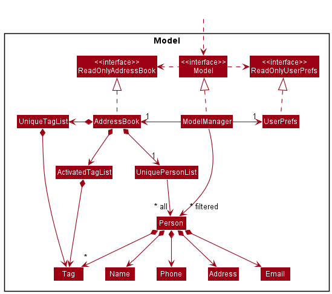

The `Model` component,

* stores the address book data i.e., all `Person` objects (which are contained in a `UniquePersonList` object).
* stores the currently 'selected' `Person` objects (e.g., results of a search query) as a separate _filtered_ list which is exposed to outsiders as an unmodifiable `ObservableList<Person>` that can be 'observed' e.g. the UI can be bound to this list so that the UI automatically updates when the data in the list change.
* stores a `UserPref` object that represents the user’s preferences. This is exposed to the outside as a `ReadOnlyUserPref` objects.
* does not depend on any of the other three components (as the `Model` represents data entities of the domain, they should make sense on their own without depending on other components)

### Storage component

**API** : [`Storage.java`](https://github.com/AY2122S2-CS2103T-T12-2/tp/tree/master/src/main/java/seedu/address/storage/Storage.java)

The `Storage` component,
* can save both address book data and user preference data in json format, and read them back into corresponding objects.
* inherits from both `AddressBookStorage` and `UserPrefStorage`, which means it can be treated as either one (if only the functionality of only one is needed).
* depends on some classes in the `Model` component (because the `Storage` component's job is to save/retrieve objects that belong to the `Model`)

### Common classes

Classes used by multiple components are in the `seedu.addressbook.commons` package.

--------------------------------------------------------------------------------------------------------------------

## **Implementations**

This section describes some noteworthy details on how certain features are implemented.

### Adding attributes to contacts

### Notes feature

#### Implementation

The Notes class encapsulates a List<String> that contains the notes added to a Person. The main feature of the class is that updating a Notes object, be it adding or deleting a note, returns a new Notes object that contains a new list with the result.

In the execution of a command that modify a contact's notes, for instance, the NoteCommand which adds a given note to a contact, a new Person object is created with the new Notes object. Thus, this implementation of Notes avoids the problem of aliasing between different Person objects, and reduces coupling.

The sequence diagram below illustrates this behaviour.

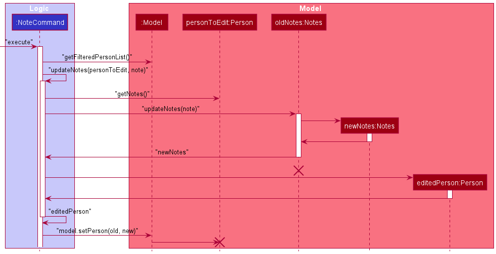

:information_source: **Note:** The lifelines for `personToEdit` and `oldNotes` should end at the destroy marker (X) but due to a limitation of PlantUML, the lifelines reaches the end of diagram.

This implementation is in line with other forms of editing a contact, and will facilitate new features you may plan to implement, such as the planned undo/redo feature.

Another reason for this implementation is the ease of testing. You will find that the TypicalPersons contains Person objects as the baseline to create a list of contacts. Writing tests for Notes is easier without having to intently reverse any changes to the Notes of these Persons.

### Favourite feature

#### Implementation

The favourites feature is implemented by identifying the user's favourite contacts through their `favouriteStatus` state,  which is stored as a `Persons` field. The favourite-status of a person is represented by a `Favourite`, which can be either `IS_FAVOURITE`, or `NOT_FAVOURITE` singletons.

Although it is a `Persons` field, it cannot be instantiated in an add command, nor modified through an edit command, unlike other fields such as "name" or "address". It should be thought of as metadata for the contact, and is set as `NOT_FAVOURITE` by default.

As such, a contact's favourite-status is handled through the `FavouritesCommand`, which extends `Command`. Toggles the contact's favourite status based on their current favourite-status. Its execution behaves rather similarly to `edit`, and has its own `FavouritesCommand#createFavouritedPerson(target, newPerson)` operation.

As part of the favourites feature, a user can also list all their favourite contacts through the `ListFavouritesCommand`, which extends `Command` as well. It leverages on the `PersonIsFavouriteContactPredicate`, which can be passed as an argument to `Model#updateFilteredPersonList(predicate)`

Given below is an example scenario of the favourites feature in operation.

Step 1. When a user is created, they are automatically assigned `NOT_FAVOURITE` as their favourite-status.

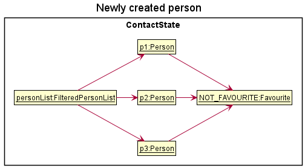

Step 2. The user executes `fav 3` command to favourite the 3rd person in the address book. The `fav` command executes and determines the current `favouriteStatus` of the contact (which in this case is `NOT_FAVOURITE`). It then calls the private helper method `createFavouritedPerson` to create a copy of the target contact, except with their `favouriteStatus` now pointing to the opposite `Favourite` value (which will be the `IS_FAVOURITE` singleton).

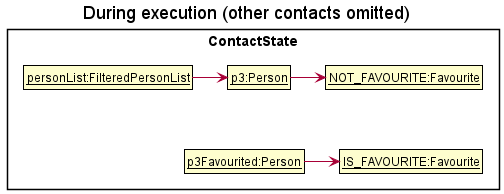

Step 3. The command execution continues on to replace the existing person object with the newly favourited contact through `Model#setPerson`. After the execution successfully terminates, the user can visually identify their favourite contacts through the yellow star right beside their contact names.

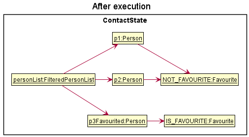

Step 4. The user decides that they want to see only their favourite contacts. The `favourites` command will then execute, passing the `PersonIsFavouriteContactPredicate` into the `Model#updateFilteredPersonList`.

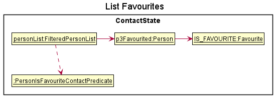

The following sequence diagram shows how the favourite operation works:

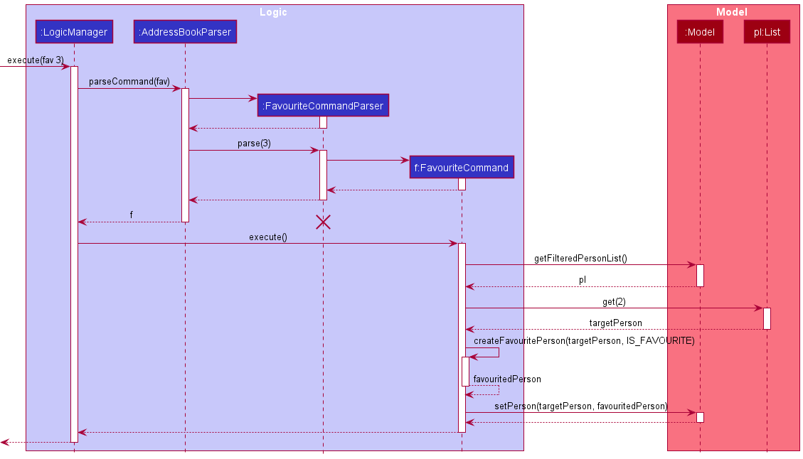

:information_source: **Note:** The lifeline for `FavouriteCommandParser` should end at the destroy marker (X) but due to a limitation of PlantUML, the lifeline reaches the end of diagram.

If the user runs `fav 3` again, or commands `fav` on an existing favourited contact, the only difference in the execution would be that the `NOT_FAVOURITE` reference will be passed into the `FavouriteCommand#createFavouritePerson` method instead.

From the user experience point of view, not having an un-favourite command is intuitive. In order to favourite a contact, they will need to look-up their current index number, in which case, they will already know if they are a favourite contact or not.
This makes toggling instead of hard-setting the favourite status of a contact feasible, and reduces the number of commands the user has to remember.

#### Design considerations:

**Aspect: How favourite and list favourite commands execute:**

* **Alternative 1 (current choice):** Each person responsible for their own favourite state
    * Pros:
        * Less coupling between favourite and other commands such as edit and delete, as well as the model.
        * Easy to reference to check favourite status of contact.
        * Easy to implement.
    * Cons:
        * Adds more fields to the person contact, increasing the complexity of the contact in the long run.
        * Need to have a `Favourite` class to represent a contact's status.
* **Alternative 2:** Store favourited contacts into a `FavouritePersonList`.
    * Pros:
        * No need to add field into `Persons` class.
        * No need to have `Favourite` class, which basically just acts as a boolean.
        * `List` command will be easy to implement.
    * Cons:
        * Have to update the `FavouritePersonList` if a favourited contact has been modified.
        * Needs more work, specially within the storage.

### Deadline feature

#### Implementation
The `deadline` mechanism borrows from the current `edit` mechanism. The main idea of the mechanism is creating a new `Person` object with added `deadline`, then replace existing `Person` in list with the new `Person`.

Step 1. The user is currently on the screen displaying the list of `Person`.

Diagram below represents the list of `Person`

Step 2. The user executes `deadline 1 /d return book 1/1/2023` command to add the deadline `1/1/2023` with description `return book` to the first person in the address book.

:information_source: **Note:** Adding multiple `deadline` is supported, for example: `deadline 1 /d return book 1/1/2023 /d write report 5/1/2023`.

Step 3. The `DeadlineCommand#execute()` method will find the `Person` at the index specified.
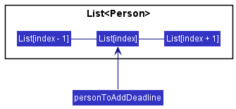

Step 4. After getting `personToAddDeadline`, `DeadlineCommand#execute()` method creates a new `Person` called `editedPerson` with added `Deadline` and all the other attributes of `personToAddDeadline`.
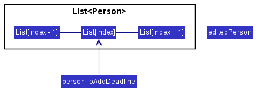

Step 5. The `editedPerson` replaces the `personToAddDeadline` in the list.
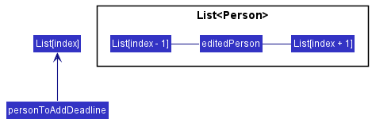

Step 6. The `UI` displays the updated list.

Diagram below shows the execution of `deadline 1 /d return book 1/1/2023` command
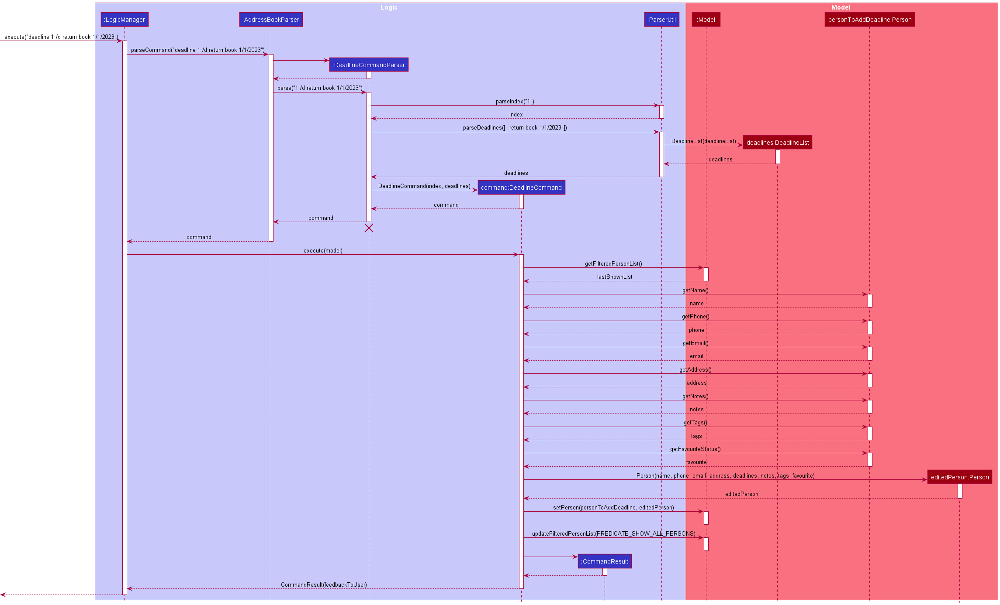

:information_source: **Note:** The lifeline for `DeadlineCommandParser` should end at the destroy marker (X) but due to a limitation of PlantUML, the lifeline reaches the end of diagram

#### Limitations and proposed solutions
Currently, `deadline` command allows duplicate deadlines to be added, it will be changed in a later version

**Solution**: Check `DeadlineList` before adding `deadline`.

(more limitations and solutions to be discovered...)

### Add contact with address as optional field feature

#### Implementation

The implemented enhanced add mechanism is facilitated by the `add` command.

Classes changed for this feature:
- `AddCommand`
- `AddCommandParser`

Given below is a code snippet implemented for `AddCommandParser`:

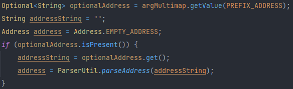

:information_source: **Note:** A string value of `*No Address Specified*` is used for `Address.EMPTY_ADDRESS` instead of an empty string.

#### Design considerations:

**Aspect: Values to accept in address field:**

* **Alternative 1 (current choice):** Having a string `*No Address Specified*` in the address field
    * Pros: Easy to implement.
    * Cons: UI may look less pleasing with repetitive words for each contact.

* **Alternative 2:** Accepting empty string in address field
    * Pros: UI may look neater and cleaner.
    * Cons: Will need to change many components for address field to be an empty string.

### High importance flag feature

#### Implementation

The implemented high importance flag feature is facilitated by using the `execute()` method in `HighImportanceCommand` with the keyword `impt` to execute the command. This feature is stored as an additional attribute `highImportanceStatus` for each person within the application and is implemented as a separate class within the `Person` package.

The `highImportanceStatus` contains an attribute `value` which takes on the values of either `"true"` or `"false"`.
- `"true"` denotes that the `Person` is a person of high importance.
- `"false"` denotes that the `Person` is a person not of high importance.

Classes added for this feature:
- `HighImportance`
- `HighImportanceCommand`
- `HighImportanceParser`

Given below is an example scenario of the high importance flag feature.

Step 1. When a user is created, they are automatically assigned `NOT_HIGH_IMPORTANCE` as their importance status.

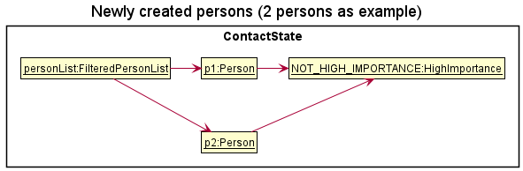

Step 2. The user executes `impt 1` command to change the high importance status of the 1st person in the address book. The `impt` command executes and determines the current `highImportanceStatus` of the contact (which in this case is `NOT_HIGH_IMPORTANCE`). It then calls the private helper method `createHighImportancePerson` to create a copy of the target contact, except with their `highImportanceStatus` now pointing to the opposite `highImportanceStatus` value (which will be `HIGH_IMPORTANCE`).

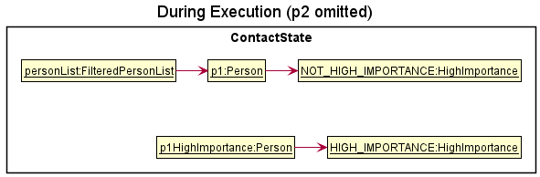

Step 3. The command execution continues on to replace the existing person object with the contact with the newly updated high importance status through `Model#setPerson`. After the successful execution, the user can visually identify their high importance contacts through the red flag beside their contact names.

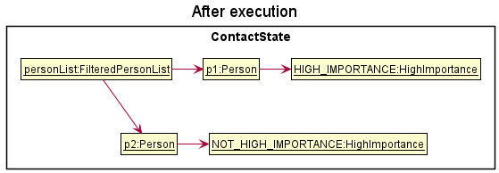

Step 4. The user decides that they want to see only their high importance contacts. The `impts` command will execute, passing the `PersonHasHighImportancePredicate` into the `Model#updateFilteredPersonList`.

The following sequence diagram shows how the feature works:

#### Design considerations:

**Aspect: How important and list important commands execute:**

* **Alternative 1 (current choice):** Each person responsible for their own high importance state
    * Pros:
        * Easy to implement.
        * Easy to check high importance status of contact.
        * Less coupling between `HighImportance` command and other commands such as edit and delete, as well as the model.
    * Cons:
        * Adds more fields to the person contact, increasing the complexity of the contact in the long run.
        * Need to have a `HighImportance` class to represent a contact's status.
* **Alternative 2:** Store contacts into a `HighImportancePersonList`.
    * Pros:
        * No need to add a field into `Person` class.
        * No need to have `HighImportance` class, which acts like a boolean value.
    * Cons:
        * Have to update the `HighImportancePersonList` if a contact of high importance has been modified.
        * Quite a fair bit of changes requires, especially within the storage.

### Images feature

#### Implementation

All images added by the user must be associated to some contact. This is done by storing a `ImageDetailsList` within
the contact's `Person` object. The `ImageDetailsList` encapsulates the information and methods of an iterable list of
`ImageDetails`. `ImageDetails` encapsulates the information of images added to the contact, such as the file name
and the filepath of the image.

It is worth noting that `ImageDetailsList` and `ImageDetails` do not actually hold the image files, but only the
file and path names. This means that an `ImageDetails` object could exist for a non-existent image file. This is resolved
by using the `ImageUtil` helper class' methods.

Apart from the `ImageDetailsList` and `ImageDetails`, the `ImageUtil` helper class can be seen as the bridge between
the `ImageDetails` object and the actual directory/image file. It contains methods to check the existence of files at
a specified filepath, copying an image into a directory, and sanitizing `ImageDetailList`s (removing `ImageDetails`
objects from the list which do not have an existing image in the specified filepath).

Users first interact with images by adding them to a specific contact through the `AddImagesCommand`. It leverages
on the `JFileChooser` class provided by `JavaFX`. This is the interface that users will encounter when trying to
select image(s) to add into the application. Note that only `.jpg` and `.png` files are allowed by default, and there
is no existing way for the user to customize it.

The `ImagesCommand` will identify the contact whose images are of interest to the user, based on the given index.
The `Logic` will then pass the `ImageDetailsList` of this `Person` into the `ImagesToView` field of the `Model`.
It will return a `SpecialCommandResult` which is `VIEW_IMAGES`, and the `UI` will then push the user to the `ViewImagesPanel`,
where the images stored in the `ImagesToView` field will be shown to the user.

The user can delete images by running the `DeleteImageCommand`, with parameters: 1. The index of the contact whose images
are to be deleted, 2. The index of the image belonging to the contact. The logic will then identify the person and the
image of choice. It will remove the `ImageDetails` object from the `Person`'s `ImageDetailsList`, _and_ delete the
image associated with it.

Given below is an example scenario of the add images feature in operation

Step 1. When a user types `addimg INDEX`, `Logic` looks for the specified person at `INDEX` based on `SortedPersonList`.

Step 2. `Logic` will then open the `JFileChooser` interface for the user to select any amount of images they wish to
add into the selected contact.

Step 3. After selecting the image(s), they will be copied through the help of the `ImageUtil` class, which leverages on the
`ImageIO` class provided by the `javax` `imageio` library, into the specified `contact_images_path` specified in the
`UserPrefs`. By default, this is `/data/images/` directory.

Step 4. Each of these newly copied images will have their filepaths stored into their own newly created `ImageDetails` objects.
The existing images of the contact, if any, will be added together with the new `ImageDetails` into a new `ImageDetailsList`

Step 5. The `ImageDetailsList` will be added to the `Person` object.

#### Design considerations

Aspect: How the images should be saved
* Alternative 1 (current choice): Image details associated with a contact is stored directly as a `Person`'s field.
    * Pros: Easier to search for a contact's images, as we only have to search for the given contact.
    * Cons: Not necessarily part of a contact's personal information. Eventually starts to bloat up the `Person` class.
* Alternative 2: Image details are stored in a list in the `Model`.
    * Pros: Easier to maintain/sanitize the list of images for outdated/corrupted images.
    * Cons: Hard to associate the images with the persons, since there is no unique identifying number/value associated
      with `Person`.

### Adding features to Model

### Find tag feature

#### Implementation

The find tag feature is used when a user is interested in finding contacts who have a certain `Tag`. Each `Person` has a set of `Tags` which contains unique `Tags` since each `Person` should not have more than 1 of the same tag.

This feature is facilitated by `FindTagCommand`, which makes use of a `List` of keywords that the `TagContainsKeywordPredicate` uses to checks if the `Tag` set of a `Person` contains all the tag names in the current `ActivatedTagList` which contains all selected keywords used as filter (case-insensitive).

Each use of the find tag feature adds the given keyword(s) into the `ActivatedTagList` that serves as a filter for selected tags. The keywords in the `ActivatedTagList` are then used to create the `TagContainsKeywordPredicate` to check the `Tag` set of each `Person`. The keywords in the `ActivatedTagList` is only cleared when `list` command is called.

The `FindTagCommand#execute()` method looks through the `Tag` set of each `Person` and updates the `Model#filteredPersons` using `Model#updateFilteredPersonsList()` which uses the `TagContainsKeywordPredicate`. The `Model` then displays the currently most updated filtered person list which reflects contacts with the specified tags in the list.

As such, `FindTagCommand` extends `Command` and executes the command by calling `FindTagCommand#execute()`.

:information_source: **Note:** If there are multiple keywords, e.g.`findtag friends colleagues`, then the contact should have both tags `friends` and `colleagues` in order for the contact to be reflected on the updated filtered person list.

Given below is an example usage scenario and how the find tag feature behaves at each step.

Step 1. The user launches the address book for the first time, initialized with the initial address book state.

Step 2. The user executes the command `findtag friends` to find contacts with the tag `friends` in their set of tags.

Step 3. The AddressBookParser parses the command `findtag friends` and creates a `FindTagCommandParser` to parse the keyword `friends`.

Step 4. The `FindTagCommand` object is created with the given keyword `friends` as a `Singleton List`.

Step 5. The current tag names in the `ActivatedTagList` are then retrieved, creating a new `TagContainsKeywordPredicate`.

Step 6. The `LogicManager` then calls `FindTagCommand#execute()`, calling `Model#updateFilteredPersonList()` which updates the list of persons to be displayed.

Step 7. The `CommandResult` created from `FindTagCommand#execute()` is returned to the `LogicManager` which will be reflected in the `ResultDisplay` of the `GUI`.

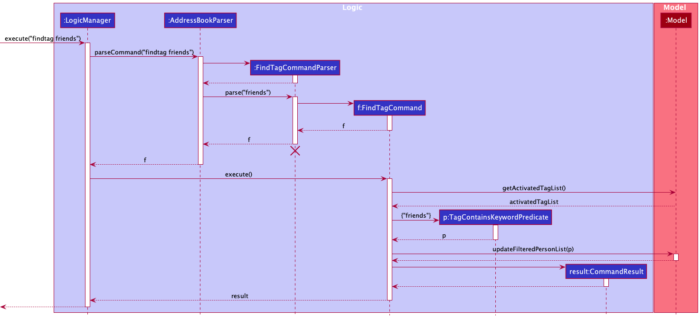

:information_source: **Note:** The lifeline for `FindTagCommandParser` should end at the destroy marker (X) but due to a limitation of PlantUML, the lifeline reaches the end of diagram.

#### Design considerations:

**Aspect: Should contacts have all the keywords searched for:**

* **Alternative 1 (current choice):** Contacts containing strictly the same tags as all the keywords searched for.
    * Pros: More intuitive, as only contacts with strictly the same tags as all the keywords searched will be listed.
    * Cons: Have to ensure the contacts are tagged correctly, or they will not be found with this feature.

* **Alternative 2:** Contacts containing any tags of the keywords searched for.
    * Pros: Can find contacts who have any tags the keywords searched.
    * Cons: Unintuitive, as we usually narrow down the scope for filtering.

### Assimilating new UI components

### Contact view feature

The detailed contact view feature is a new component added to the UI. The detailed view would replace the list of
contacts when it is requested. While in this view, commands to edit the contact no longer need to specify an index,
since it is implied that the contact to edit is the one being displayed. Thus, implementing the feature required
resolving the following two challenges:

1. How to tell the UI whether to show the list panel or the detailed view panel.
2. How to support alternative command formats for modifying the contact in detailed view

#### Implementation

The first challenge is particularly complex, as switching between panel views is done through commands, which are
executed by `Logic`, and modify `Model`. In the current design, commands are not aware of UI.

However, the `MainWindow` class does have some responsibilities to fulfill in the process of command execution. It
handles the special cases where the command is either `ExitCommand` or `HelpCommand`, and closes the main window or
displays the help window respectively. Building upon this behaviour, the `CommandResult`, produced by every `Command`
after its execution, can be responsible for signalling to the `MainWindow` to change view. The main draw of this
implementation is that `MainWindow` continues to solely handle UI-related responsibilities, while `Command` will handle
the logic of what should be displayed, hence preserving the Single-Responsibility Principle.

For the second challenge, since the `MainWindow` knows which panel it is displaying, the `LogicManager` can be
informed to parse the command differently.

To illustrate the behaviour of the implementation, let's examine the process where the user passes
`note r/red`, while the MainWindow is displaying the detailed contact view.

:information_source: **Note:** In the follwing sequence diagrams, the
lifelines for deleted objects should end at the destroy marker (X) but due to a limitation of PlantUML, the lifeline
reaches the end of diagram.

Step 1. The user gives the command `note r/red`. `MainWindow` realises it is in detailed view, and calls
`LogicManager::executeInDetailedViewMode`.

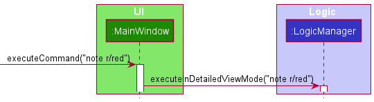

Step 2. `LogicManager` calls `AddressBookParser::parseInDetailedViewContext` to parse the user input in a different
way. The method returns a `NoteCommand`, which is a `DetailedViewExecutable`. Note that `NoteCommandParser`
successfully parsed a `NoteCommand` without an index.

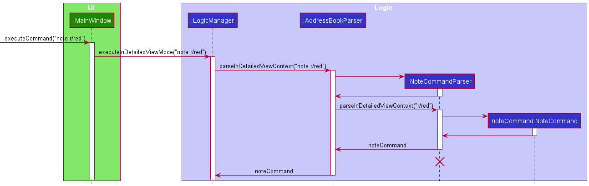

Step 3. `LogicManager` calls `NoteCommand::executeInDetailedView`. `NoteCommand` executes a slightly different logic,
as it can get `personToEdit` from `model::getDetailedContactViewPerson`. It replaces `personToEdit` in both the person
list as well as in the detailed contact view. Finally, the `CommandResult` produced has the field
`SpecialCommandResult.DETAILED_VIEW`, and is returned to `LogicManager`.

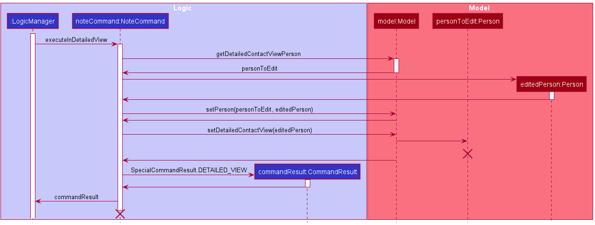

Step 4. `LogicManager` returns the same `CommandResult` to `MainWindow`. `MainWindow` checks and finds that it has
to call its `handleDetailedView` method. It continues to show the detailed view panel.

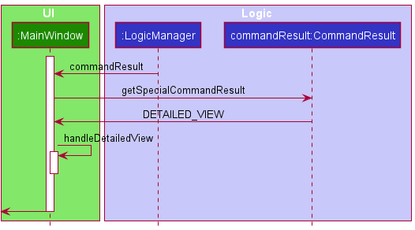

To summarise, here is a generalised sequence diagram for a command execution in detailed view mode, with some details
omitted.

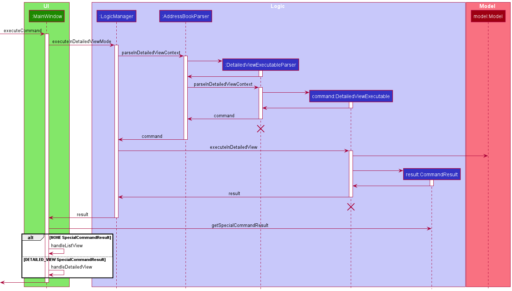

#### Design Considerations

To support this implementation, on top of the Command design pattern that was in place, the `DetailedViewExecutable`
interface was added to enforce which commands can run in detailed view mode. This implementation does not preserve the
Command design pattern. Notice that commands have to implement two separate kinds of execute method, when the ideal
case is that commands are simply executed by `LogicManager`, without having to intently call two different kinds of
`execute`.

This can be resolved by having an intermediate abstract class `DetailedViewExecutableCommand`, that extends `Command`
and is inherited by concrete `Command` classes. `LogicManager` will parse for a `DetailedViewExecutableCommand`, and
call its `execute` method.

However, there are also cons for such a method. The following table gives some comparisons.

| Aspect                    | Interface forcing additional `execute` methods (current choice)                                     | Abstract Class allowing singular `execute` method                                                                     |
|---------------------------|-----------------------------------------------------------------------------------------------------|-----------------------------------------------------------------------------------------------------------------------|
| Effort to change          | More lines of code required implementing multiple methods with some repetition                      | Less lines of code as some code is common between different execution and can be placed in one method                 |
| Extensibility             | Easy to extend to include more types of command using a new interface and implementing a new method | Difficult to extend as adding existing commands to a new type requires rewriting existing code and regression testing |
| Simplicity                | Easy to reason as command execution is isolated to each method and depends on which is called       | Difficult to reason as command execution depends on potentially many external factors                                 |

However, one area that both implementations can improve is interacting with Model. Due to the pre-existing requirements,
commands only needed `Index` as a way to retrieve a `Person` object from `Model`. For commands running in detailed view
mode, this `Index` was not required, but retrieving a `Person` explicitly called `getDetailedContactViewPerson` of the
`ModelManager`.

A more ideal solution is for commands to have an `Identifier` field, which can retrieve a `Person` from a `Model`. The
`Identifier` can be an `Index`, which will be a superclass, or a different superclass that will retrieve the `Person`
in detailed view. Do note that `Index` is a utility class for indexing and is used in places other than identifying
`Person` in the contact list. You should implement a different class to behave like an index for this usage so as to
preserve Single Responsibility Principle.

This feature has potential to be even more useful. If commands are enhanced to support operating on multiple `Person`
at once, a new `Identifier` can be implemented to support this, thus changes to commands will be minimal.

### Enhancing data storage

### \[Proposed\] Undo/redo feature

#### Proposed Implementation

The proposed undo/redo mechanism is facilitated by `VersionedAddressBook`. It extends `AddressBook` with an undo/redo history, stored internally as an `addressBookStateList` and `currentStatePointer`. Additionally, it implements the following operations:

* `VersionedAddressBook#commit()` — Saves the current address book state in its history.
* `VersionedAddressBook#undo()` — Restores the previous address book state from its history.
* `VersionedAddressBook#redo()` — Restores a previously undone address book state from its history.

These operations are exposed in the `Model` interface as `Model#commitAddressBook()`, `Model#undoAddressBook()` and `Model#redoAddressBook()` respectively.

Given below is an example usage scenario and how the undo/redo mechanism behaves at each step.

Step 1. The user launches the application for the first time. The `VersionedAddressBook` will be initialized with the initial address book state, and the `currentStatePointer` pointing to that single address book state.

Step 2. The user executes `delete 5` command to delete the 5th person in the address book. The `delete` command calls `Model#commitAddressBook()`, causing the modified state of the address book after the `delete 5` command executes to be saved in the `addressBookStateList`, and the `currentStatePointer` is shifted to the newly inserted address book state.

Step 3. The user executes `add n/David …​` to add a new person. The `add` command also calls `Model#commitAddressBook()`, causing another modified address book state to be saved into the `addressBookStateList`.

:information_source: **Note:** If a command fails its execution, it will not call `Model#commitAddressBook()`, so the address book state will not be saved into the `addressBookStateList`.

Step 4. The user now decides that adding the person was a mistake, and decides to undo that action by executing the `undo` command. The `undo` command will call `Model#undoAddressBook()`, which will shift the `currentStatePointer` once to the left, pointing it to the previous address book state, and restores the address book to that state.

:information_source: **Note:** If the `currentStatePointer` is at index 0, pointing to the initial AddressBook state, then there are no previous AddressBook states to restore. The `undo` command uses `Model#canUndoAddressBook()` to check if this is the case. If so, it will return an error to the user rather
than attempting to perform the undo.

The following sequence diagram shows how the undo operation works:

:information_source: **Note:** The lifeline for `UndoCommand` should end at the destroy marker (X) but due to a limitation of PlantUML, the lifeline reaches the end of diagram.

The `redo` command does the opposite — it calls `Model#redoAddressBook()`, which shifts the `currentStatePointer` once to the right, pointing to the previously undone state, and restores the address book to that state.

:information_source: **Note:** If the `currentStatePointer` is at index `addressBookStateList.size() - 1`, pointing to the latest address book state, then there are no undone AddressBook states to restore. The `redo` command uses `Model#canRedoAddressBook()` to check if this is the case. If so, it will return an error to the user rather than attempting to perform the redo.

Step 5. The user then decides to execute the command `list`. Commands that do not modify the address book, such as `list`, will usually not call `Model#commitAddressBook()`, `Model#undoAddressBook()` or `Model#redoAddressBook()`. Thus, the `addressBookStateList` remains unchanged.

Step 6. The user executes `clear`, which calls `Model#commitAddressBook()`. Since the `currentStatePointer` is not pointing at the end of the `addressBookStateList`, all address book states after the `currentStatePointer` will be purged. Reason: It no longer makes sense to redo the `add n/David …​` command. This is the behavior that most modern desktop applications follow.

The following activity diagram summarizes what happens when a user executes a new command:

#### Design considerations:

**Aspect: How undo & redo executes:**

* **Alternative 1 (current choice):** Saves the entire address book.
    * Pros: Easy to implement.
    * Cons: May have performance issues in terms of memory usage.

* **Alternative 2:** Individual command knows how to undo/redo by
  itself.
    * Pros: Will use less memory (e.g. for `delete`, just save the person being deleted).
    * Cons: We must ensure that the implementation of each individual command are correct.

--------------------------------------------------------------------------------------------------------------------

## **Documentation, logging, testing, configuration, dev-ops**

* [Documentation guide](Documentation.md)
* [Testing guide](Testing.md)
* [Logging guide](Logging.md)
* [Configuration guide](Configuration.md)
* [DevOps guide](DevOps.md)

--------------------------------------------------------------------------------------------------------------------

## **Appendix: Requirements**

### Product scope

**Target user profile**:

d'Intérieur is designed for interior designers who:

* Have a preference for CLI apps
* have many clients and projects to keep track of
* can type fast
* prefer typing to mouse interactions

**Value proposition**: organise information on client and projects, giving a one-stop overview of current work progress and schedule.

### User stories

Priorities: High (must have) - `* * *`, Medium (nice to have) - `* *`, Low (unlikely to have) - `*`

| Priority | As a …​                                   | I want to …​                                                                         | So that I can…​                                                                                   |
|----------|-------------------------------------------|--------------------------------------------------------------------------------------|---------------------------------------------------------------------------------------------------|
| `* * *`  | new user                                  | look at a basic tutorial for adding contacts                                         | understand what details I can add to a contact                                                    |
| `* * *`  | busy interior designer                    | add a new contact quickly                                                            | reduce time on adding new contacts                                                                |
| `* * *`  | user                                      | delete a contact                                                                     | remove entries that I no longer need                                                              |
| `* * *`  | user                                      | find a contact by name                                                               | locate details of contacts without having to go through the entire list                           |
| `* * *`  | interior designer                         | label my contacts with some fixed labels                                             | categorise my clients based on the stage of design I am at                                        |
| `* * *`  | interior designer with many ongoing leads | filter my contacts list based on label                                               | easily keep track of who I am working with at a specific point of time without having to remember |
| `* * *`  | interior designer                         | add notes under a contact                                                            | keep track of the demands and requirements of each individual project                             |
| `* * *`  | busy interior designer                    | add a deadline under a contact                                                       | keep track of my deadlines easily                                                                 |
| `* * *`  | user                                      | favourite certain contacts                                                           | look up favourites and contact them easily                                                        |
| `* * *`  | interior designer                         | add images under a client                                                            | keep track of images such as floor plans and inspirational designs relevant to the client         |
| `* *`    | interior designer                         | check upcoming deadlines in chronological order                                      | keep track of deadlines automatically                                                             |
| `* *`    | long-time user                            | separate past and current clients                                                    | avoid contacting clients with similar names or old clients that I am not presently working with   |
| `* *`    | new user                                  | view a list of commands                                                              | know what commands are available and the right commands to use                                    |
| `* *`    | interior designer                         | add a high importance flag to a client                                               | take note of pressing issues regarding a client, such as mobility issues                          |
| `*`      | interior designer                         | track and calculate costs accumulated for a client                                   | at a glance, know how much money has been spent on them for a project                             |
| `*`      | interior designer                         | generate invoices                                                                    | easily generate, store and print invoices for my clients                                          |
| `*`      | interior designer                         | send out automated messages/emails to clients to wish them well on festive occasions | maintain good rapport with clients                                                                |
| `*`      | user                                      | create contacts by importing information from other apps                             | create contacts more easily                                                                       |

### Use cases

(For all use cases below, the **System** is `d'Intérieur` and the **Actor** is the `user`, unless specified otherwise)

**UC01: Add a contact**

**MSS**

1. User adds a person with the required fields.
2. d'Intérieur shows the new contact added with the details entered.

  Use case ends.

**Extensions**

* 1a. User includes address field.

  * Use case resumes at step 2.

**UC02: Delete a contact**

**MSS**

1. User requests to list contacts.
2. d'Intérieur shows a list of contacts.
3. User requests to delete a specific contact in the list.
4. d'Intérieur shows contact deleted and updates the list.

  Use case ends.

**Extensions**

* 2a. The list is empty.

  Use case ends.

* 3a. The given index is invalid.

    * 3a1. d'Intérieur shows an error message.

      Use case resumes at step 2.

**UC03: Add a label to a contact**

**MSS**

1. User requests to list contacts.
2. d'Intérieur shows a list of contacts.
3. User requests to add a label to a specific contact in the list.
4. d'Intérieur adds the label to the contact and shows the contact.

  Use case ends.

**Extensions**

* 2a. The list is empty.

  Use case ends.

* 3a. The given index is invalid.

    * 3a1. d'Intérieur shows an error message.

      Use case resumes at step 2.

* 3b. The label requested does not currently exist in d'Intérieur.

    * 3b1. <ins>Add a label to d'Intérieur (UC08)</ins>

      Use case ends.

**UC04: Filter contacts using labels**

**MSS**

1. User requests list of contacts filtered to those containing the given label.
2. d'Intérieur shows a list of contacts who have the given label.

  Use case ends.

**Extensions**

* 1a. The given label does not exist.

  * <ins>Add a label to d'Intérieur (UC08)</ins>
  
    Use case ends.

**UC05: Adding a note to a contact**

**MSS**

1. User requests to add a note to a specific contact in the list.
2. d'Intérieur adds the note to the contact and shows the contact.

  Use case ends.

**Extensions**

* 1a. User enters only whitespaces or nothing as a note.

  * 1a1. d'Intérieur alerts the user that no changes have been made to notes

    Use case ends.

* 1b. The given index is invalid.

    * 1b1. d'Intérieur shows an error message.

      Use case resumes at step 1.

**UC06: Adding a contact to favourites**

**MSS**

1. User requests to add a specific contact in the list to favourites.
2. d'Intérieur adds the contact to favourites and shows the contact.

  Use case ends.

**Extensions**

* 1a. The given index is invalid.

    * 1a1. d'Intérieur shows an error message.

      Use case resumes at step 1.

**UC07: Add a deadline**

1. User requests to add a deadline under a contact.
2. d'Intérieur adds the deadline under the contact and shows the contact.

  Use case ends.

**Extensions**

* 1a. The deadline given does not contain a valid date or time.

    * 1a1. d'Intérieur shows an error message.

      Use case ends

* 1b. The given index is invalid.

    * 1b1. d'Intérieur shows an error message.

      Use case ends.

**UC08: Add a label to d'Intérieur**

**MSS**

1. User requests to create a label to label contacts in the contact list.
2. d'Intérieur adds the label to the contact list.

Use case ends.

**Extensions**

* 1a. User enters non-alphanumeric name or nothing as the name for the label.

    * 1a1. d'Intérieur alerts the user that the given name is invalid.

      Use case ends.
    
**UC09: Deleting a label in d'Intérieur**

**MSS**

1. User requests to delete one or more labels in the contact list.
2. d'Intérieur deletes the given labels and <ins>unassign (UC10)</ins> the labels from every contact.

Use case ends.

**Extensions**

* 1a. User enters all labels that do not exist.

    * 1a1. d'Intérieur alerts the user that the given labels do not exist.

      Use case ends.

* 1b. Users enter some labels that do not exist.

    * 1b1. d'Intérieur alerts the user that only some labels will be deleted.

      Use case resumes at step 2.

**UC10: Unassign a label from a contact**

**MSS**

1. User requests to unassign a label from a specified contact.
2. d'Intérieur removes the given label from the specified contact.

Use case ends.

**Extensions**

* 1a. The given label does not exist.

    * <ins>Add a label to d'Intérieur (UC08)</ins>

      Use case ends.

**UC11: Updating contact information in detailed view**

**MSS**

1. User requests to view a contact's full information.
2. d'Intérieur shows the contact's full information.
3. User edits the contact's information.
4. d'Intérieur updates the contact's information and displays it.  
   Steps 3 and 4 repeats until the user has updated the contact as they have needed.
5. User requests to list contacts.
6. d'Intérieur shows the list of contacts

Use case ends.

**UC12: Adding an image to a contact**

**MSS**

1. User requests to add image(s) to a contact.
2. d'Intérieur adds the images to the given contact.
3. d'Intérieur shows the newly added images in the images view.

Use case ends.

**Extensions**

* 1a. User closes the interface without selecting any image(s).

    * 1a1. d'Intérieur alerts the user that no images have been added. 

      Use case ends.

**UC13: Deleting an image from a contact**

**MSS**

1. User requests to delete an image from a contact.
2. d'Intérieur removes the image from the contact.

Use case ends.

**UC14: Listing all images of a contact**

**MSS**

1. User requests to view all images of a contact.
2. d'Intérieur lists all their image(s) in the images view panel.

Use case ends.

### Non-Functional Requirements

1. Should work on any _mainstream OS_ as long as it has Java `11` or above installed.
2. Should be able to hold up to 1000 contacts without a noticeable sluggishness in performance for typical usage.
3. A user with above average typing speed for regular English text (i.e. not code, not system admin commands) should be able to accomplish most of the tasks faster using commands than using the mouse.
4. Should work on both 32-bit and 64-bit environments.
5. The system should boot up within five seconds.
6. The system is not required to handle a non-text input.
7. The system should be able to have up to 5000 contacts.
8. The response to any action should become visible within five seconds.

### Glossary

* **User** and **Interior Designer**: Both are used interchangeably as d'Intérieur is enhanced for interior designers
* **Contact**: An entry in the d'Intérieur app
* **Client**: A specific type of contact that interior designers will most likely keep track of
* **Mainstream OS**: Windows, Linux, Unix, OS-X
* **Private contact detail**: A contact detail that is not meant to be shared with others

--------------------------------------------------------------------------------------------------------------------

## **Appendix: Instructions for manual testing**

Given below are instructions to test the app manually.

:information_source: **Note:** These instructions only provide a starting point for testers to work on;
testers are expected to do more *exploratory* testing.

### Launch and shutdown

1. Initial launch

   1. Download the jar file and copy into an empty folder

   1. Double-click the jar file Expected: Shows the GUI with a set of sample contacts. The window size may not be optimum.

1. Saving window preferences

   1. Resize the window to an optimum size. Move the window to a different location. Close the window.

   1. Re-launch the app by double-clicking the jar file. 
       Expected: The most recent window size and location is retained.

### Deleting a person

1. Deleting a person while all persons are being shown

   1. Prerequisites: List all persons using the `list` command. Multiple persons in the list.

   1. Test case: `delete 1` 
      Expected: First contact is deleted from the list. Details of the deleted contact shown in the status message. Timestamp in the status bar is updated.

   1. Test case: `delete 0` 
      Expected: No person is deleted. Error details shown in the status message. Status bar remains the same.

   1. Other incorrect delete commands to try: `delete`, `delete x`, `...` (where x is larger than the list size) 
      Expected: Similar to previous.

### Commands in detailed view

*Refer to the command summary table in the User Guide for all the valid commands to test.*

1. Commands that work in both list view and detailed view

   1. Prerequisite: Use `view` on a contact.

   1. Test case: `note r/Likes dark wood`  
      Expected: Note `Likes dark wood` is added to the contact's list of notes.

   1. Test case: `note 2 r/Likes dark wood`  
      Expected: Same outcome as above test case where no index is specified

   1. Test case: `note Likes dark wood`  
      Expected: No note added. Error details shown.

   1. Repeat above three test cases for other commands, using the correct detailed view command format, followed by the list view command format, and lastly erroneous command formats, if any.

1. Commands that do not work in detailed view

   1. Prerequisite: Use `view` on a contact.
   
   1. Test case: `clear`  
      Expected: Error message shown, using `list` will show that the list of contacts were not cleared.
   
   1. Repeat the test for other commands that do not work in detailed view.
   
### Creating a tag

1. Creating a tag after clearing sample data

    1. Test case: `tag Friends` 
       Expected: Friends tag is created. 
    
   1. Test case: `tag Friends & Colleagues` 
       Expected: No tag is created. Error details shown in the status message. 

   1. Other incorrect commands to try: `tag`, `tag _`, `tag -1`, `tag foo Bar`, `tag TAGNAME`, `...` (where TAGNAME is non-alphanumeric) 
       Expected: Similar to previous.
