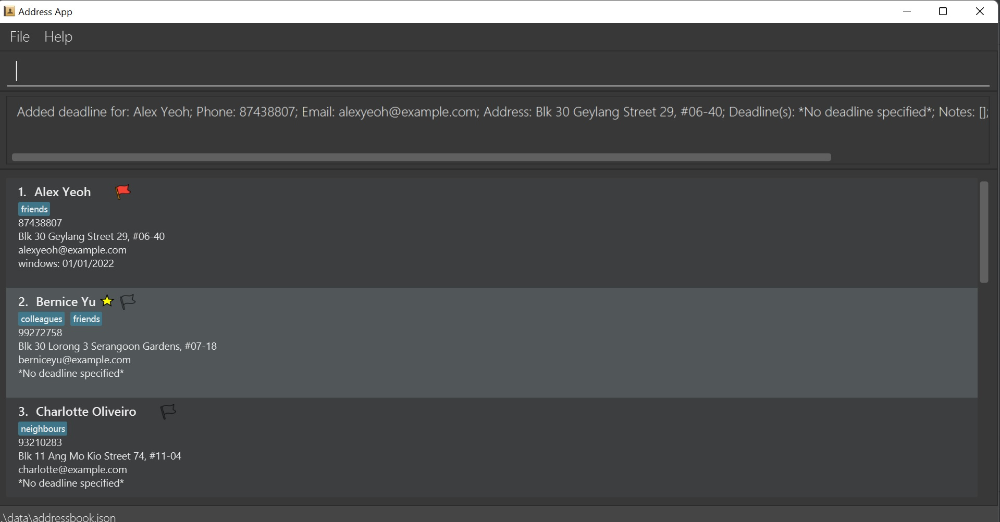

d'Intérieur is a **desktop app for interior designers to manage their contacts and projects, optimized for use via a 
Command Line Interface** (CLI) while still having the benefits of a Graphical User Interface (GUI). 
If you can type fast, d'Intérieur can get your contact management tasks done faster than traditional GUI apps.

If you utilize other online applications for interior designing and lack a centralized, robust, and efficient customer
management tool, this application will be able to meet your needs.

In this user guide, we will work you through the basic use cases and commands of the application, so that you can 
quickly get started and make full of use of what the application has to offer.

* Table of Contents {:toc}

--------------------------------------------------------------------------------------------------------------------

## Quick start

1. Ensure you have Java `11` or above installed in your Computer.

2. Download the latest `dinterieur.jar` from [here](https://github.com/AY2122S2-CS2103T-T12-2/tp/releases).

3. Copy the file to the folder you want to use as the _home folder_ for your d'Intérieur.

4. Double-click the file to start the app. The GUI similar to the below should appear in a few seconds. Note how the app
   contains some sample data. 
   

5. Type the command in the command box and press Enter to execute it. e.g. typing **`help`** and pressing Enter will
   open the help window. 
   Some example commands you can try:

    * **`list`** : Lists all contacts.

    * **`add n/Mary Jane p/12345678 e/maryJ@example.com`** : Adds a contact named Mary Jane to the Address Book.

    * **`delete`** `3` : Deletes the 3rd contact shown in the current list.

    * **`fav`** `2` : Adds the 2nd contact shown in the current list to your list of favourite contacts

    * **`favourites`** : Lists all your favourite contacts.

    * **`clear`** : Deletes all contacts.

    * **`exit`** : Exits the app.

6. Refer to the [Features](#features) below for details of each command.

--------------------------------------------------------------------------------------------------------------------

## Features

**:information_source: Notes about the command format:** 

* Words in `UPPER_CASE` are the parameters to be supplied by the user. 
  e.g. in `add n/NAME`, `NAME` is a parameter which can be used as `add n/Mary Jane`.

* Items in square brackets are optional. 
  e.g `n/NAME [t/TAG]` can be used as `n/Mary Jane t/friend` or as `n/Mary Jane`.

* Items with `…`​ after them can be used multiple times including zero times. 
  e.g. `[t/TAG]…​` can be used as ` ` (i.e. 0 times), `t/friend`, `t/friend t/family` etc.

* Parameters can be in any order. 
  e.g. if the command specifies `n/NAME p/PHONE_NUMBER`, `p/PHONE_NUMBER n/NAME` is also acceptable.

* If a parameter is expected only once in the command but you specified it multiple times, only the last occurrence of
  the parameter will be taken. 
  e.g. if you specify `p/12341234 p/56785678`, only `p/56785678` will be taken.

* Extraneous parameters for commands that do not take in parameters (such as `help`, `list`, `exit` and `clear`) will be
  ignored. 
  e.g. if the command specifies `help 123`, it will be interpreted as `help`.

### Viewing help : `help`

Shows a message explaining how to access the help page.

Format: `help`

### Adding a contact : `add`

You can add a contact to the address book with the address as an optional field.

Format: `add n/NAME p/PHONE_NUMBER e/EMAIL [a/ADDRESS] [t/TAG]…​`

:bulb: **Tip:**
A contact can have 0 or 1 address

:bulb: **Tip:**
A contact can have any number of tags (including 0)

Examples:

* `add n/John Doe p/98765432 e/johnd@example.com`
* `add n/Mary Jane p/12345678 e/maryJ@example.com a/Bukit Timah t/completed`

### Listing all contacts : `list`

Shows the list view with all contacts in the address book.

Format: `list`

### Viewing a contact's full details : `view`

Allows you to view the full details of the contact, as some are hidden in the contact list.

Format `view INDEX`

#### Commands in detailed view

Some commands may work differently in the detailed view from in the list view. 

In general, commands for modifying a contact will work, and will modify the contact currently displayed. As such, there is no need to give an index for those commands anymore, and they will be ignored if the command is called in this view.

If the command does not work in the current view, the app will inform you. To return to list view, use `list`.

You may check out the summary table of commands for the overview.

### Editing a contact : `edit`

Edits an existing contact in the address book. This command can be used in detailed view.

Format: `edit INDEX [n/NAME] [p/PHONE] [e/EMAIL] [a/ADDRESS]…​`

:bulb: **Tip:**
To edit tags, use assign and unassign commands

* Edits the contact at the specified `INDEX`. The index refers to the index number shown in the displayed contact list.
  The index **must be a positive integer** 1, 2, 3, …​
* At least one of the optional fields must be provided.
* Existing values will be updated to the input values.

Examples:

* `edit 1 p/91234567 e/johndoe@example.com` Edits the phone number and email address of the 1st contact to be `91234567`
  and `johndoe@example.com` respectively.
* `edit 1 n/John` Edits the name of the 1st contact to be `John`.

Format in detailed view: `edit [n/NAME] [p/PHONE] [e/EMAIL] [a/ADDRESS]…​`

Example:

* `edit p/88438809 e/alex_yeoh@example.com` Edits the phone number and email address of the contact in detailed view to
  be `88438809` and `alex_yeoh@example.com` respectively.

### Adding favourites : `fav`

Toggles the favourite status of your contacts. This command can be used in detailed view.
Favourited contacts **can be un-favourited** by running the same command on the contact again.

Format: `fav INDEX`

:bulb: **Tip:**
You can run `fav INDEX` where `INDEX` is the index of a contact that currently belongs in your favourites list to remove them.

Example: `fav 1` — Adds contact at index 1 to your list of favourites

- `fav 1` - Run the command for the same contact, and the favourite status will be toggled off.

Format in detailed view: `fav`

Example: `fav` Adds the currently viewed contact to your list of favourites.

### Listing Favourites : `favourites`

Lists all your favourite contacts to the list of displayed contacts. This command only works in list view.

Format: `favourites`

### Adding high importance flag : `impt`

Adds the contact to your list of contacts with high importance and a red flag will appear beside the contact's name to indicate that. 
This command can be used in detailed view.

Format: `impt INDEX`

:bulb: **Tip:**
When a red flag appears beside the contact's name, you can run `impt INDEX` again where `INDEX` is the index of a contact that currently belongs in your list of contacts with high importance to remove them.

:bulb: **Tip:**
You may wish to use the `note` command to add a note to indicate why the contact is important. E.g. Mobility Issues.

Format in detailed view: `impt`

Example: `impt` Adds the currently viewed contact to your list of contacts with high importance.

### Listing contacts with high importance : `impts`

Shows you all contact(s) with high importance, tagged with the red flag. This command only works in list view.

Format: `impts`

### Prioritising relevant contacts to you : `sort`

Sort contacts by given criteria. This command only works in list view.

Format: `sort CRITERIA`
* `CRITERIA` should be written in lower-case.

Examples:
* `sort name` sorts list by name alphabetically.
* `sort fav` sorts list so that favourite contacts are on top of the list.

### Locating contacts by name : `find`

Find contacts whose names contain any of the given keywords. This command only works in list view.

Format: `find KEYWORD [MORE_KEYWORDS]`

* The search is case-insensitive. e.g `hans` will match `Hans`
* The order of the keywords does not matter. e.g. `Hans Bo` will match `Bo Hans`
* Only the name is searched.
* Only full words will be matched e.g. `Han` will not match `Hans`
* Contacts matching at least one keyword will be returned (i.e. `OR` search). e.g. `Hans Bo` will return `Hans Gruber`
  , `Bo Yang`

Examples:

* `find John` returns `john` and `John Doe`
* `find alex david` returns `Alex Yeoh`, `David Li` 
  

### Locating contacts by tag : `findtag`

Find contacts with the given tag. This command only works in list view.

Format: `findtag KEYWORD [MORE_KEYWORDS]`

* The search is case-insensitive. e.g `tag` will match `Tag`
* Only the tag is searched
* Only full words will be matched e.g. `Ta` will not match `Tag`
* List of contacts matching at least the searched tag\(s\) will be returned. e.g. `Tag1` will return `Contact` A with
  tags `Tag1` and `Tag2` will be returned.

Examples:

* `findtag Friends` returns contacts with tag `Friends`
* `findtag InProgress AlmostFinished` returns contacts tagged by at least both `InProgress` and `AlmostFinished`

### Creating a tag : `tag`

Creates a tag that can be assigned to any contact. This command can be used in detailed view with the same format.

Format: `tag TAGNAME`

* A tag with the same `TAGNAME` can only be created once.
* The `TAGNAME` is case-insensitive. e.g. creating the tag `friends` will not allow `Friends` to be created. 

Example:

* `tag Friends` creates a tag `Friends` to be stored in the address book.

### Assigning a tag to a contact : `assign`

Assigns a created tag to a contact. This command can be used in detailed view.

Format: `assign INDEX TAGNAME`

* Assigns a `TAG` with a given `TAGNAME` to a contact at the specified `INDEX`
* The `TAG` given by the `TAGNAME` must be created first. 
* The `TAGNAME` is case-insensitive.
* The index refers to the index number shown in the displayed contact list.
* The index **must be a positive integer** 1, 2, 3, ...​
* The contact should have **at most one** `TAG` with a given unique `TAGNAME`.
* The contact assigned to the given `TAGNAME` cannot be assigned to the same `TAGNAME` again.
e.g. assigning the tag `friends` to Alice at index 1 will not allow `Friends` to be assigned to the same contact.

Example:

* `assign 1 Friends` assigns a tag `Friends` to the contact at index `1`.

Format in detailed view: `assign TAGNAME`

Example:

* `assign client` assigns a tag `client` to the currently viewed contact.

### Unassigning a tag from a contact : `unassign`

Unassigns a created tag from a contact. This command can be used in detailed view.

Format: `unassign INDEX TAGNAME`

* Removes a `TAG` with a given `TAGNAME` from a contact at the specified `INDEX`
* The `TAG` given by the `TAGNAME` must be created first.
* The `TAGNAME` is case-insensitive.
* The index refers to the index number shown in the displayed contact list.
* The index **must be a positive integer** 1, 2, 3, ...​
* The contact must have been assigned to this `TAG` previously.

Example:

* `unassign 1 Friends` removes the tag `Friends` from the contact at index `1`.

Format in detailed view: `unassign TAGNAME`

Example:

* `unassign client` removes the tag `client` from the currently viewed contact.

### Deleting a contact : `delete`

Deletes the specified contact from the address book. This command only works in list view.

Format: `delete INDEX`

* Deletes the contact at the specified `INDEX`.
* The index refers to the index number shown in the displayed contact list.
* The index **must be a positive integer** 1, 2, 3, …​

Examples:

* `list` followed by `delete 2` deletes the 2nd contact in the address book.
* `find Betsy` followed by `delete 1` deletes the 1st contact in the results of the `find` command.

### Adding deadlines to meet in relation to a contact : `deadline`

Creates a deadline that is placed under the profile of a contact. This command can be used in detailed view.

Format: `deadline INDEX d/DESCRIPTION DATE [d/DESCRIPTION DATE]...`

- deadline must have description.
- The given date is added to the contact as deadline.
- Date should be dd/mm/yyyy

Example:

- `deadline 1 d/windows 01/01/2022` adds a deadline with description `windows` and date `01/01/2022` to the contact in index `1`.

List before `deadline` command:

List after `deadline` command:

Format in detailed view: `deadline d/DESCRIPTION DATE [d/DESCRIPTION DATE]...`

Example:

- `deadline d/Lunch meeting 03/06/2022` adds a deadline with description `Lunch meeting` and date `03/06/2022` to the 
currently viewed contact.

### Deleting a deadline from a contact : `deldl`

Deletes the deadline under the contact in detailed view. This command cannot be used in list view.

Format: `deldl INDEX`

- Deletes the note at the index of the list of deadlines displayed.

Example:

`view 2` shows you the detailed view of  the contact at index 2, then using `deldl 2` will delete the second deadline in the
notes list of the contact

### Adding additional notes to a contact : `note`

Adds the given note under the contact. This command can be used in detailed view.

Format: `note INDEX r/NOTES`

- Notes are displayed in a list.
- The given note is appended to the existing list of notes at the end.

:bulb: **Tip:**
Notes store good-to-know information about the user. To classify contacts so that you can search for them, use tags instead.

Example:

- `note 2 r/loves green` will add a note under the contact at index 2 that reads `loves green`.

Format in detailed view: `note r/NOTES`

Example:

- `note r/Likes wood furniture` will add a note to currently viewed contact that reads `Likes wood furniture`.

### Deleting notes from a contact : `delnote`

Deletes the note under the contact in detailed view. This command cannot be used in list view.

Format: `delnote INDEX`

- Deletes the note at the index of the list of notes displayed.

Example:

`view 1` shows you the detailed view of  the contact at index 1, then using `delnote 2` will delete the second note in the 
notes list of the contact

### Clearing all entries : `clear`

Clears all entries from the address book. This command can only be used in list view.

Format: `clear`

### Exiting the program : `exit`

Exits the program.

Format: `exit`

### Saving the data

d'Intérieur data are saved in the hard disk automatically after any command that changes the data. There is no need to
save manually.

### Editing the data file

d'Intérieur data are saved as a JSON file `[JAR file location]/data/addressbook.json`. Advanced users are welcome to
update data directly by editing that data file.

:exclamation: **Caution:**
If your changes to the data file makes its format invalid, d'Intérieur will discard all data and start with an empty data file at the next run.

### Archiving data files `[coming in v2.0]`

_Details coming soon ..._

--------------------------------------------------------------------------------------------------------------------

## FAQ

**Q**: How do I transfer my data to another Computer? 
**A**: Install the app in the other computer and overwrite the empty data file it creates with the file that contains
the data of your previous d'Intérieur home folder.

--------------------------------------------------------------------------------------------------------------------

## Command summary

_*Detailed view format and examples to be added*_

| Action           | Format, Examples in List View                                                                                                                   | Format, Examples in Detailed View                                                                      |
|------------------|-------------------------------------------------------------------------------------------------------------------------------------------------|--------------------------------------------------------------------------------------------------------|
| **Add**          | `add n/NAME p/PHONE_NUMBER e/EMAIL [a/ADDRESS] [t/TAG]…​`   e.g., `add n/Mary Jane p/12345678 e/maryJ@example.com a/Bukit Timah t/completed` | Same as list view                                                                                      |
| **Assign Tag**   | `assign INDEX TAGNAME`   e.g., `assign 1 Friends`                                                                                            | `assign TAGNAME`   e.g., `assign client`                                                            |
| **Clear**        | `clear`                                                                                                                                         | -                                                                                                      |
| **Create Tag**   | `tag TAGNAME`   e.g., `tag Friends`                                                                                                          | Same as list view                                                                                      |
| **Deadline**     | `deadline INDEX d/DESCRIPTION DATE [d/DESCRIPTION DATE]...`   e.g., `deadline 1 d/windows 01/01/2022`                                        | `deadline d/DESCRIPTION DATE [d/DESCRIPTION DATE]...`   e.g., `deadline d/Lunch meeting 03/06/2022` |
| **Delete**       | `delete INDEX`  e.g., `delete 3`                                                                                                             | -                                                                                                      |
| **Edit**         | `edit INDEX [n/NAME] [p/PHONE_NUMBER] [e/EMAIL] [a/ADDRESS] …​`  e.g.,`edit 2 n/James Lee e/jameslee@example.com`                            | `edit [n/NAME] [p/PHONE] [e/EMAIL] [a/ADDRESS]…​`   e.g., `edit p/88438809 e/alex_yeoh@example.com` |
| **Fav**          | `fav INDEX`   e.g., `fav 1`                                                                                                                  | `fav`                                                                                                  |
| **Favourites**   | `favourites`                                                                                                                                    | -                                                                                                      |
| **Find**         | `find KEYWORD [MORE_KEYWORDS]`  e.g., `find James Jake`                                                                                      | -                                                                                                      |
| **Find Tag**     | `findtag KEYWORD [MORE_KEYWORDS}`   e.g., `findtag Friends`                                                                                  | -                                                                                                      |
| **Help**         | `help`                                                                                                                                          | Same as list view                                                                                      |
| **Impt**         | `impt INDEX`   e.g., `impt 1`                                                                                                                | `impt`                                                                                                 |
| **Impts**        | `impts`                                                                                                                                         | -                                                                                                      |
| **Sort**         | `sort CRITERIA`   e.g., `sort address`                                                                                                       | -                                                                                                      |
| **List**         | `list`                                                                                                                                          | Same as list view                                                                                      |
| **Note**         | `note INDEX r/NOTES`  e.g. `note 2 r/loves green`                                                                                            | `note r/NOTES`   e.g., `note r/Likes wood furniture`                                                |
| **Unassign Tag** | `unassign INDEX TAGNAME`   e.g., `unassign 1 Friends`                                                                                        | `unassign TAGNAME`   e.g., `unassign client`                                                        |
| **View**         | `view INDEX`   e.g., `view 1`                                                                                                                | -                                                                                                      |

